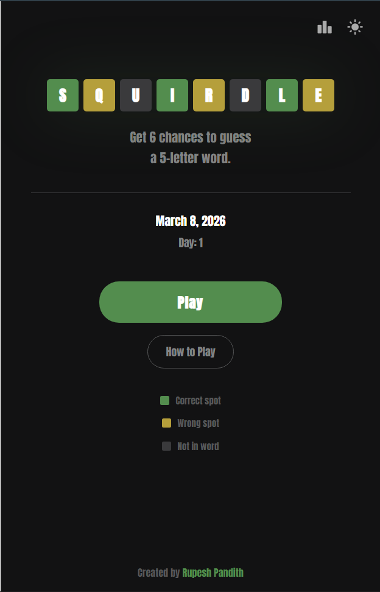
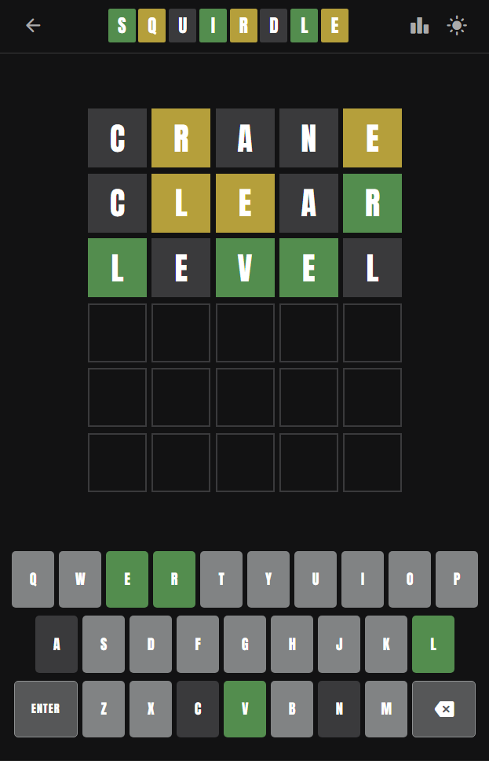
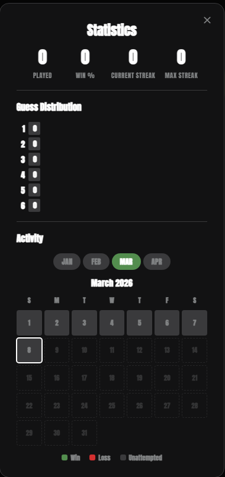

<div align="center">

# 🟩 SQUIRDLE

**A daily word puzzle game — guess the 5-letter word in 6 tries.**

Built with React + Vite + Capacitor for Android.

[](https://react.dev/)
[](https://vite.dev/)
[](https://capacitorjs.com/)
[](LICENSE)

</div>

---

## 📖 About

Squirdle is a Wordle-inspired word puzzle game where you get **6 chances** to guess a **5-letter word** every day. Each guess reveals which letters are correct, misplaced, or not in the word — using color-coded feedback.

A **new puzzle** is released daily at midnight. Come back every day for a new challenge!

## ✨ Features

- 🎮 **Classic Wordle Gameplay** — 6 guesses, 5-letter words, color-coded tile feedback
- 📅 **Daily Puzzles** — A unique word every day using a seeded algorithm (no repeats for ~6.3 years)
- 📊 **Statistics & Streaks** — Track games played, win %, current streak, max streak, and guess distribution
- 🗓️ **Calendar Heatmap** — Monthly activity view showing wins (green), losses (red), and unattempted days
- 🌙 **Dark & Light Theme** — Toggle between themes, preference is saved
- 🔔 **Daily Reminders** — Push notification at 6:00 PM to remind you to play
- 💾 **Game Persistence** — Close and reopen the app without losing progress
- 🎯 **One Game Per Day** — Ensures fair play, no replaying the same day
- 🎨 **Smooth Animations** — Tile flip, pop, bounce, shake, and toast animations
- 📱 **Mobile-First Design** — Full-screen immersive mode, responsive across all screen sizes
- ⌨️ **Dual Input** — On-screen keyboard + physical keyboard support

## 🖼️ Screenshots

<p align="center">
  
  &nbsp;&nbsp;
  
  &nbsp;&nbsp;
  
</p>

## � Download & Install

1. Go to the [**Releases**](https://github.com/rupeshpandith/Squirdle/releases) page
2. Download the latest **Squirdle.apk** file to your Android phone
3. Open the downloaded file — if prompted, tap **Settings** and enable **Install from unknown sources** for your browser/file manager
4. Tap **Install** → **Open**
5. That's it! A new puzzle awaits you every day at midnight 🎉

> **Note:** The app sends a daily reminder at 6:00 PM. When prompted, allow notification permission for the best experience.

## �🛠️ Tech Stack

| Layer | Technology |
|---|---|
| **Frontend** | React 19, JSX |
| **Build Tool** | Vite 7.3 |
| **Mobile** | Capacitor 8.2 (Android) |
| **Notifications** | @capacitor/local-notifications |
| **Styling** | CSS3 (custom properties, CSS Grid, animations) |
| **Font** | [Anton](https://fonts.google.com/specimen/Anton) (Google Fonts) |
| **Icons** | [Material Symbols Rounded](https://fonts.google.com/icons) |

## 📁 Project Structure

```
src/
├── App.jsx                  # Root component, theme, routing
├── App.css                  # All application styles
├── index.css                # CSS reset & global defaults
├── main.jsx                 # React entry point
├── components/
│   ├── Board.jsx            # 6×5 game board grid
│   ├── Tile.jsx             # Individual tile with flip/bounce
│   ├── Header.jsx           # Top bar with logo, stats, theme toggle
│   ├── Keyboard.jsx         # On-screen QWERTY keyboard
│   ├── Modal.jsx            # Win/Lose modal
│   ├── HomePage.jsx         # Landing page with play button
│   ├── Stats.jsx            # Statistics panel + calendar heatmap
│   ├── HowToPlay.jsx        # How to play instructions
│   └── Title.jsx            # Logo tile component
├── hooks/
│   └── useWordle.js         # Core game logic, state, persistence
├── utils/
│   ├── evaluateGuess.js     # Two-pass guess evaluation algorithm
│   └── notifications.js     # Daily push notification scheduling
└── data/
    ├── answers.js           # 2,315 answer words
    └── validGuesses.js      # 10,657 additional valid guesses
```

## 🚀 Getting Started

### Prerequisites

- [Node.js](https://nodejs.org/) (v18+)
- [Android Studio](https://developer.android.com/studio) (for APK builds)

### Installation

```bash
# Clone the repository
git clone https://github.com/rupeshpandith/Squirdle.git
cd Squirdle

# Install dependencies
npm install

# Start development server
npm run dev
```

The app will be running at `http://localhost:5173`.

### Build for Android

```bash
# Build web assets and sync to Android
npm run build
npx cap add android
npx cap sync

# Open in Android Studio
npx cap open android
```

Then in Android Studio: **Build → Build Bundle(s) / APK(s) → Build APK(s)**

## 🎮 How to Play

1. Type a 5-letter word and press **Enter**
2. Tiles change color to show how close your guess was:
   - 🟩 **Green** — Letter is in the correct spot
   - 🟨 **Yellow** — Letter is in the word but wrong spot
   - ⬛ **Grey** — Letter is not in the word
3. Use the feedback to refine your next guess
4. You have **6 attempts** to find the word

## 🧠 How the Daily Word Works

Each day maps to a unique word using a deterministic algorithm:

```
wordIndex = (dayInCycle × 1103 + 37) mod 2315
```

- **1103** is coprime to 2315, ensuring every word is used before any repeats
- The cycle covers **~6.3 years** of unique daily puzzles
- Same word for every player on the same day

## 📜 License

This project is open source and available under the [MIT License](LICENSE).

## 👤 Author

**Rupesh Pandith**

- GitHub: [@rupeshpandith](https://github.com/rupeshpandith)

---

<div align="center">

Made with ❤️ by Rupesh Pandith

</div>
